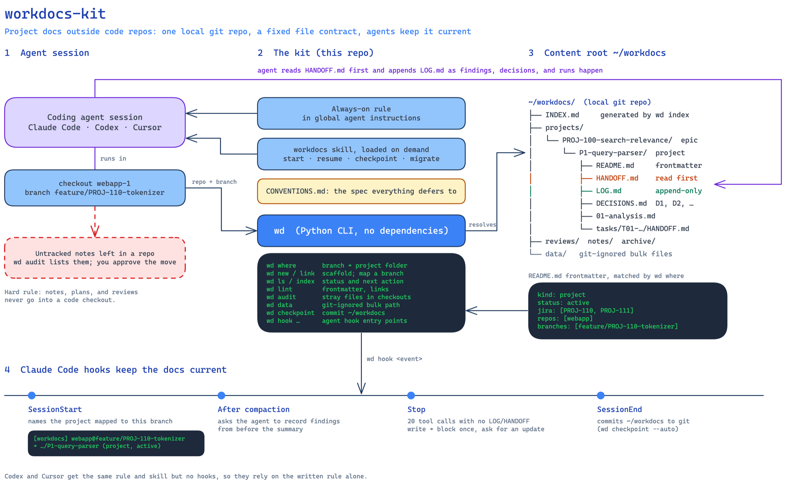

# workdocs kit

A convention plus a small CLI for keeping personal project documentation (notes, analyses, plans, reviews, agent handoffs, analysis scripts, downloaded artifacts) outside code repos, in a form any coding agent can pick up mid-project.

The problem it solves: when you work with coding agents across several checkouts and branches, notes pile up as untracked files inside repos, each session starts without knowing what the last one found, and the state of a multi-week investigation lives only in your head. Workdocs puts every project in one place (`~/workdocs`, a local git repo), gives each project a fixed set of files an agent reads first (`HANDOFF.md`) and appends to (`LOG.md`), and maps the branch you are on to the right project automatically.



| Piece | Where | Role |
|---|---|---|
| Conventions | [CONVENTIONS.md](CONVENTIONS.md) | the spec: layout, per-project file contract, frontmatter, naming, completion protocol |
| Templates | [templates/](templates/) | files `wd new` and agents copy |
| CLI | [bin/wd](bin/wd) | resolve the current checkout to a project, scaffold, link, lint, audit, commit, agent hooks |
| Skill | [skills/workdocs/SKILL.md](skills/workdocs/SKILL.md) | procedures agents follow (start, resume, checkpoint, migrate) |
| Always-on rule | [agents/work-docs-rule.md](agents/work-docs-rule.md) | goes into your global agent instructions so agents never write notes into repos |
| Example | [examples/workdocs/](examples/workdocs/README.md) | a populated content root with fictional projects |
| Design notes | [docs/DESIGN.md](docs/DESIGN.md) | why it is shaped this way |

Content is not stored in this repo. It lives in the content root (default `~/workdocs`), with machine settings in `~/.config/workdocs/config`. Requirements: Python 3.9+, git, bash. No third-party packages.

## Install

```bash
git clone https://github.com/michalsi/workdocs-kit.git ~/projects/workdocs-kit
~/projects/workdocs-kit/install.sh
```

The installer is idempotent. It creates the content root and config, symlinks `wd` into `~/.local/bin`, and links the skill into `~/.claude/skills`, `~/.codex/skills`, and `~/.cursor/skills-cursor` for whichever of those agents is installed. Then edit `AUDIT_REPOS` and `JIRA_PROJECTS` in `~/.config/workdocs/config` and wire the agents as below.

### All agents

Add the block in [agents/work-docs-rule.md](agents/work-docs-rule.md) to your global agent instructions (`~/.claude/CLAUDE.md`, `~/.codex/AGENTS.md`, or Cursor's User Rules). Skills load only when their description matches the request, and "fix this test" never matches a docs skill, so the rule that notes go to workdocs has to be loaded in every session.

### Claude Code (`~/.claude/settings.json`)

Add next to any existing hooks, with the absolute path to `wd` (hook processes may not have your PATH):

```json
"hooks": {
  "SessionStart": [{"hooks": [{"type": "command", "command": "/Users/you/.local/bin/wd hook session-start"}]}],
  "SessionEnd":   [{"hooks": [{"type": "command", "command": "/Users/you/.local/bin/wd hook session-end"}]}],
  "Stop":         [{"hooks": [{"type": "command", "command": "/Users/you/.local/bin/wd hook stop"}]}]
}
```

and the absolute path of the content root to `permissions.additionalDirectories`.

- Session start prints one to three `[workdocs]` lines naming the project mapped to the current branch. After a context compaction it also reminds the agent to record anything from before it.
- Stop blocks the agent once when `NUDGE_AFTER` (default 20) tool calls have passed in a workdocs project without a LOG/HANDOFF write. It reads the session transcript and never fires twice for the same stretch of work.
- Session end commits any uncommitted workdocs changes with a timestamp message.

### Codex (`~/.codex/config.toml`)

```toml
[sandbox_workspace_write]
writable_roots = ["/Users/you/workdocs"]
```

Codex has no session-start hook here; the global rule tells the agent to run `wd where`.

### Cursor

Paste the rule into Settings → Rules → User Rules. The installer links the skill into `~/.cursor/skills-cursor/`.

## Using it

You give agents tasks; they find the project, read its HANDOFF, and keep the docs current.

| You want to | Say to the agent (any checkout) | What happens |
|---|---|---|
| Start a new project | "start a project for PROJ-1234: <one-line goal>" | `wd new` creates `projects/PROJ-1234-<slug>/` with README, HANDOFF, LOG and links the current branch |
| Start a sub-project of an epic | "start a project for PROJ-1234 under the search epic" | same, inside the epic folder |
| Resume existing work | "continue phase-2", "where are we on PROJ-1234?" | `wd where` finds the folder; the agent reads HANDOFF and reports status and next action |
| Review someone's PR | "review PR #123 (PROJ-456) and save the review" | one file in `reviews/`; a second round is appended to it |
| Save a one-off analysis | "write this up as a note" | one file in `notes/` |
| Record something now | "log this", "record this decision", "update the handoff" | LOG entry / DECISIONS entry / HANDOFF refresh |
| Finish a project | "close this project" | `status: done`, final LOG entry; the folder stays where it is |
| Clean loose notes out of a repo | "move my loose notes out of webapp" | `wd audit`, a proposed mapping for you to approve, then the move |

Before you leave a long session, say "update the handoff": hooks help, but Esc or closing the terminal can still cut off the last few minutes. On a fresh branch, mention the ticket key once; after that, sessions on that branch are matched to the project automatically.

### Commands

| Command | Does |
|---|---|
| `wd ls` / `wd ls --all` | active (or all) units with last log date and next action |
| `wd where [KEY-or-name]` | folder for the current branch, or for a key/name (exit 0 one match, 2 none, 3 several) |
| `wd new PROJ-1234-slug [--epic <epic>]` | scaffold a project; `--kind review\|note` for single files |
| `wd link <project>` | map the current branch to an existing project |
| `wd promote <file>` | turn a note or review into a project |
| `wd data <project>` | path for bulky files (git-ignored `data/…`) |
| `wd audit [<checkout>…]` | untracked files left in your checkouts |
| `wd lint`, `wd index`, `wd checkpoint -m "…"` | check, regenerate INDEX.md, commit |
| `wd root`, `wd kit` | print the content root, or this kit's directory |

To try it without installing anything:

```bash
WORKDOCS_ROOT="$PWD/examples/workdocs" bin/wd ls --all
```

## Adapting it

Change the root, ticket key pattern, trunk branch names, and audited checkouts in the config file; environment variables of the same name override it. Ticket keys default to the Jira shape (`ABC-123`), but any `KEY-number` scheme works. Change the conventions by editing `CONVENTIONS.md`; the skill and CLI read it rather than duplicating it. Run the tests after changing `wd`:

```bash
python3 -m unittest discover -s bin -p '*_test.py' -v < /dev/null
```

## License

MIT. See [LICENSE](LICENSE).
